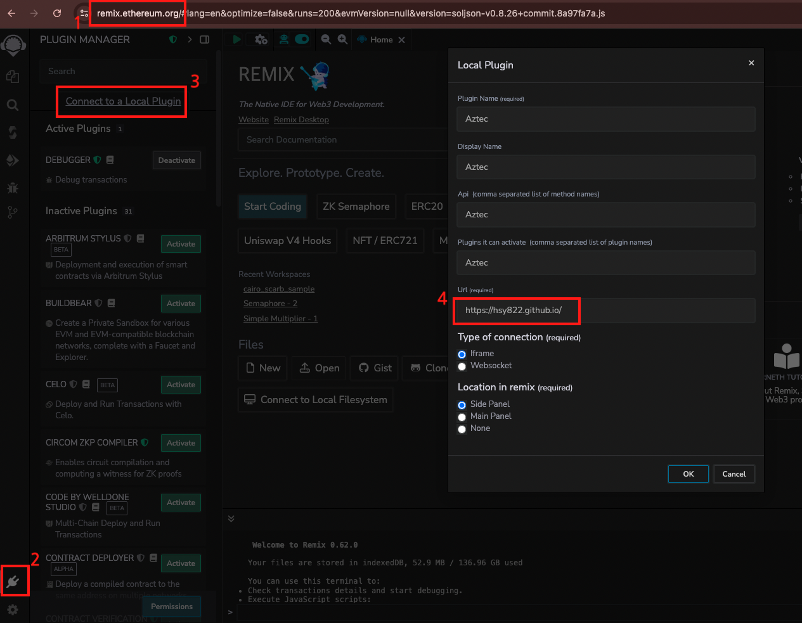
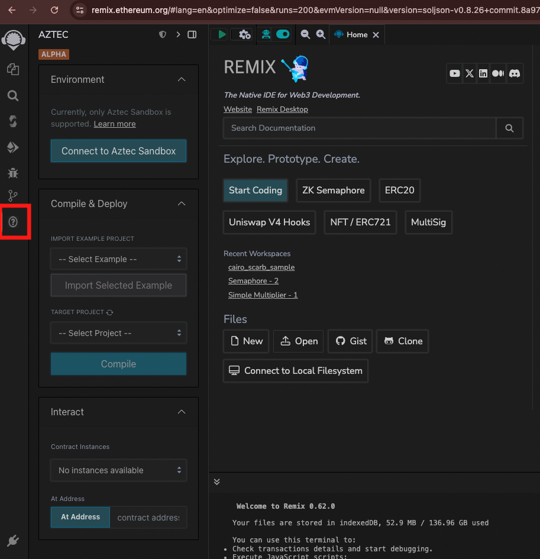

# Aztec Remix Plugin

A Remix plugin for compiling, deploying, and interacting with **Aztec** private smart contracts written in **Noir**.

---





## 🔧 Features

- Compile Aztec Noir smart contracts using `aztec-nargo`
- Deploy compiled contracts to the Aztec Sandbox
- Interact with deployed contracts (simulate & send)
- Import example Noir projects (e.g., `counter`, `token`)
- Automatically detect and manage multiple contract artifacts
- Supports `At Address` to interact with external deployed contracts

---

## How to Use

### Load the Plugin

Go to https://remix.ethereum.org and Click **Plugin Manager**

Click "Connect to a Local Plugin"

Enter `https://hsy822.github.io/` in the **URL** field, select **iframe** and **side panel**, then click **OK**.

### Open the Aztec Plugin

Click the Plugin logo on the left panel

Start coding with Aztec smart contracts!

## Getting Started

### Project Structure

Your Aztec Noir projects must be placed under the `aztec/` folder in Remix’s file explorer:

```
aztec/
  └─ my_project/
        ├─ src
        │   └─ main.nr
        └─ Nargo.toml
```

> Only projects under `aztec/` with `Nargo.toml` are recognized as valid.

---

### Compile

1. Select a project under `TARGET PROJECT`
2. Click `Compile`
3. Compiled artifacts (`.json`) will appear under `target/` inside your project

---

### Deploy

1. After compile, select a `.json` contract artifact
2. Provide initializer parameters if required
3. Click `Deploy`
4. Deployed contract address will be shown and saved for interaction

---

### Interact

- Select a deployed contract instance
- Filter and select a function from ABI
- Provide input values
- Simulate (view functions) or Send (execute)

---

### 🛰️ At Address (External Contracts)

To interact with a contract deployed externally:

1. Place a `.json` artifact under the root `aztec/` folder (e.g., `aztec/my_contract.json`)
2. Enter the contract address in the `At Address` section
3. Click `At Address` to connect and interact

---

## Sandbox Version

This plugin currently supports the **Aztec Sandbox** only.

> Make sure you're running the local sandbox (`aztec start --sandbox`) at `http://localhost:8080`.

---

## ➕ Additional Features

- WebSocket-based live compilation logs
- Compilation job queue with real-time position display
- Example project import with conflict detection
- Automatic artifact discovery

---

## License

MIT License.

---

## Contributing

Pull requests are welcome! For major changes, please open an issue first to discuss what you would like to change.
